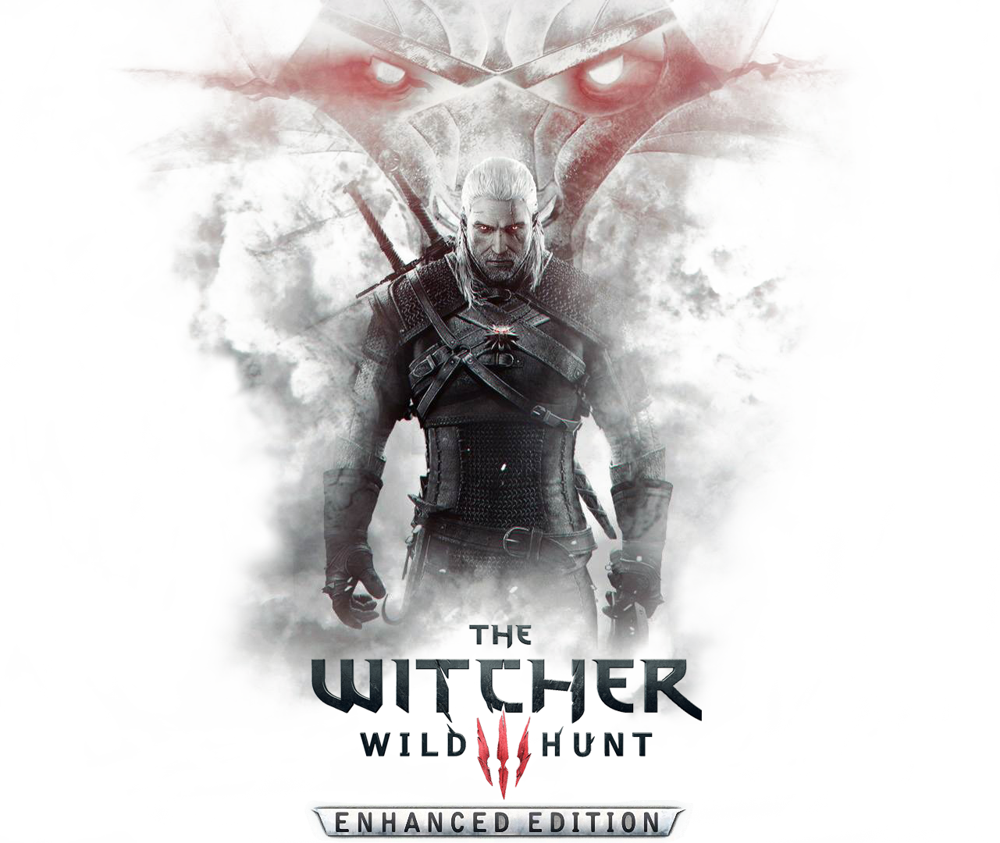

  

  <h3 align="center">
    W3EE v3.26 Merges
  </h3>

 

## Included mods

#### Base
- [Unification Patch](https://www.nexusmods.com/witcher3/mods/2134/?)
- [Debug Console](https://www.nexusmods.com/witcher3/mods/1555/?)
- [Bootstrap](https://www.nexusmods.com/witcher3/mods/2109/?)
- [Shared Imports](https://www.nexusmods.com/witcher3/mods/2110/?)
- [W3EE v3.26](https://www.nexusmods.com/witcher3/mods/2521/?)
- [W3EE - All Quest Objectives](https://www.nexusmods.com/witcher3/mods/2521/?)
- [W3EE - Immersive Cam](https://www.nexusmods.com/witcher3/mods/2521/?)

#### UI
- [Clock Only](https://www.nexusmods.com/witcher3/mods/1662/?)
- [Hud Positioning and Scale](https://www.nexusmods.com/witcher3/mods/861?)
- [Witcher Sense Color Customizer](https://www.nexusmods.com/witcher3/mods/125/?) - Used to remove yellow interaction color
- [Unseen Monsters](https://www.nexusmods.com/witcher3/mods/646/?)

#### Gameplay
- [Block and Dodge Whenever You Want](https://www.nexusmods.com/witcher3/mods/1080/?)

#### Custom Tweaks
- Fixed poisoned blades talent as described by DominusSicarum in the posts
- Added ability to toggle enemy healthbar while in combat
- Added game time slider and option to show 24hr clock
- Show subtitles for foreign languages

## Installation
1. Start with a fresh install of The Witcher 3
2. Copy the bin, content, dlc and mods folders to your Witcher 3 folder and allow files to be overwritten
3. Copy user.settings to your Witcher 3 folder located in Documents to use my default settings

#### Optional gamepad setup
4. Download [Antimicro](https://github.com/AntiMicro/antimicro)
5. Copy my input.settings and antimicro/profile

## Credits
All credits go to CD Project Red and the original mod authors
